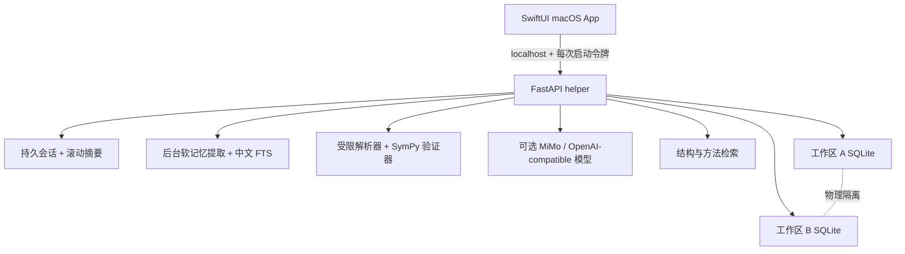

# Math Harness

一个面向数学学习、研究和知识积累的本地优先 AI Harness。它现在既是可以接入模型进行
自然语言交流的原生 macOS 对话 App，也是一个带独立验算、人工复核和可审计成长闭环的
数学工作台。你可以为不同数学方向创建彼此隔离的工作区，让系统逐步积累交流偏好、学习
目标和可信的方法卡。

[下载最新版](https://github.com/yule1048596-art/math-harness/releases/latest) ·
[查看全部版本](https://github.com/yule1048596-art/math-harness/releases) ·
[MIT License](LICENSE)

> 当前版本：**v0.15.0 Beta**。推荐使用 Apple Silicon Mac 和 macOS 14 或更高版本。
> 当前公开安装包使用 ad-hoc 签名，尚未完成 Developer ID 公证。

## 它能做什么

- 为渐进估计、极限、级数或其他主题建立互不干扰的独立工作区；
- 在每个工作区中建立多个持久对话，像普通 AI 聊天软件一样输入自然语言；
- 为单个对话单独指定模型服务，切换即时生效，无需重启；
- 搜索、重命名、归档会话，并对任意消息重新生成或编辑后重发；
- 自动整理用户画像、学习目标、专题背景和讲解偏好，并在同一工作区的新对话中继续使用；
- 用滚动摘要、近期消息、软记忆和当前工作区已晋级方法维持可控的对话上下文；
- 使用离线 SymPy，或接入任意 OpenAI 兼容服务商（MiMo、OpenAI、DeepSeek、Kimi、智谱、
  通义、OpenRouter、SiliconFlow、本地 Ollama 等），生成候选解和简洁推导；
- 为对话、求解、目标整理、方法提炼、记忆和异模型复核六个环节分别指定模型，把高频
  低难度的调用放到便宜模型上；
- 直接用自然语言问任何数学领域的题目，系统自己从回答里找出可检验的断言、验一遍并
  标注可信度——微积分、线性代数、平面几何（复数法）、组合数学、复变函数、逻辑推理
  用的是同一个检查器；
- 按**双轴**标注可信度：结论对不对是一轴，推导站不站得住是另一轴，分开显示；
- 用受限表达式解析器和 SymPy 独立验收候选答案；
- 把对话中的已解题自动保存为待复核知识草稿；
- 通过人工复核把可信例题和方法晋级到当前工作区的知识库；
- 在以后遇到相似结构的题目时，检索已经晋级的方法卡辅助求解；
- 批量导入 JSON、JSONL 或 NDJSON 题库，并在写入前统一预检、验算和去重；
- 把完整工作区备份为 `.mathharness` 文件，并恢复成不覆盖原数据的新副本。

Math Harness 的“成长”目前指的是**可审计的记忆、方法卡、结构检索和反馈统计不断积累**，
不是在本机修改大模型权重。模型负责提出候选内容，独立验证器和人工复核负责建立信任。

## 目录

- [下载安装](#下载安装)
- [第一次启动](#第一次启动)
- [配置模型服务](#配置模型服务)
- [使用持久对话](#使用持久对话)
- [使用记忆工坊](#使用记忆工坊)
- [完成第一次求解](#完成第一次求解)
- [让工作区逐步成长](#让工作区逐步成长)
- [批量导入题库](#批量导入题库)
- [备份与恢复](#备份与恢复)
- [数学表达式填写规范](#数学表达式填写规范)
- [结果状态说明](#结果状态说明)
- [数据、安全与隐私](#数据安全与隐私)
- [常见问题](#常见问题)
- [从源码运行和 API 开发](#从源码运行和-api-开发)
- [当前边界](#当前边界)

## 下载安装

### 方式一：安装 macOS App（推荐）

系统要求：

- Apple Silicon Mac（M1、M2、M3、M4 或后续 ARM64 机型）；
- macOS 14 Sonoma 或更高版本；
- 使用 MiMo 时需要网络和有效的 MiMo API Key；离线 SymPy 模式不需要密钥。

安装步骤：

1. 打开 [最新 Release](https://github.com/yule1048596-art/math-harness/releases/latest)。
2. 下载文件名类似 `Math-Harness-0.15.0-macOS-arm64.dmg` 的安装镜像。
3. 打开 DMG，把 `Math Harness.app` 拖入“应用程序”文件夹。
4. 从“应用程序”中启动 Math Harness。

当前安装包还没有 Apple Developer ID 公证。如果 macOS 阻止首次打开：

1. 在 Finder 中按住 Control 点击 `Math Harness.app`；
2. 选择“打开”；
3. 在系统确认框中再次选择“打开”。

也可以前往“系统设置 → 隐私与安全性”，对刚刚被阻止的 Math Harness 选择“仍要打开”。
不建议全局关闭 Gatekeeper。

Release 同时提供 ZIP、Python wheel 和源码包。普通 Mac 用户只需下载 DMG。

### 方式二：从源码启动 macOS App

适合开发者或希望跟踪 `main` 分支的人。需要 Git、
[uv](https://docs.astral.sh/uv/) 和 Apple Command Line Tools：

```bash
xcode-select --install
git clone https://github.com/yule1048596-art/math-harness.git
cd math-harness
uv sync --frozen --no-editable --extra dev --extra llm
./scripts/run_macos_app.sh
```

源码模式会通过 `uv` 启动本地 Python 后端。Release 中的独立 App 已包含 Python、SymPy、
FastAPI 和模型客户端，最终用户不需要另外安装这些依赖。

## 第一次启动

### 1. 创建工作区

首次打开后，点击左侧栏底部的 **“+”** 或 **“新建工作区”**：

- **名称**：建议写清数学方向，例如“渐进估计”“实分析极限”或“Gamma 函数渐近”；
- **描述**：说明这个空间接受什么题、不接受什么题，以及希望形成怎样的方法体系。

每个工作区拥有独立的 SQLite 数据库、会话、消息、摘要、软记忆、例题、方法卡、求解历史
和学习事件。工作区 A 中的聊天、记忆和方法不会出现在工作区 B 中。同一个工作区越聚焦，
检索到的背景和方法通常越相关。

推荐做法：

- 按数学专题建空间，而不是把所有数学内容塞进一个空间；
- 把“渐进估计”和“初等几何”分开；
- 如果需要实验不同的题库策略，可以创建两个工作区做对照。

### 2. 选择求解器

Math Harness 默认使用离线 **SymPy**：不发送网络请求，也不需要 API Key。它适合已经
填写可验证目标的极限、等价、展开和表达式等价问题，但覆盖范围有限。离线模式仍会保存
完整对话，不过普通聊天只会返回透明的离线说明，不会伪装成通用语言模型。

如果希望直接输入自然语言、获得更灵活的推导和方法提炼，可以接入模型服务。配置方法
见下一节。

## 配置模型服务

### 在 macOS App 中配置

1. 点击工具栏的 **齿轮** 按钮，或按 `⌘,`，或从菜单 **“Math Harness → 设置……”** 打开。
2. 在 **“模型服务”** 页点击左下角 **“添加”**，选择一个服务商。内置预设：

   | 服务商 | 说明 |
   |---|---|
   | 小米 MiMo | `https://api.xiaomimimo.com/v1`，模型 `mimo-v2.5-pro` |
   | OpenAI | 官方端点 |
   | DeepSeek / Kimi / 智谱 GLM / 通义千问 | 各自的 OpenAI 兼容端点 |
   | OpenRouter / SiliconFlow | 聚合服务 |
   | Ollama（本地） | `http://127.0.0.1:11434/v1`，不需要密钥 |
   | 自定义 | 自行填写 Base URL |

3. 填写 API Key、确认模型名。
4. 点击 **“测试连接”**，确认能打通再保存——这一步会告诉你到底是密钥被拒、模型名
   不存在、连不上，还是被限流。
5. 在 **“角色分配”** 页选择这个服务。默认「简单模式」用同一个服务跑全部环节。
6. 点击 **“应用并重启数学引擎”**。

**结构化输出模式**：MiMo 只支持 JSON Object 模式，OpenAI 支持严格 Schema。预设已经
替你选好；接入自定义服务商时如果结构化输出总是失败，先检查这一项。

**分环节配置**：关闭简单模式后，可以为对话、求解、目标整理、方法提炼、记忆和异模型
复核六个环节分别指定服务和模型。记忆提取和目标整理调用频繁、难度不高，配便宜模型能
明显省钱；求解建议配强模型。除复核外，任何环节都可以设为离线，保留零成本路径。

**异模型复核**必须绑到与「对话」「求解」**不同**的档案才有意义。相同时这一层会自动
跳过而不是退化成自查——同模型自查是负收益，让模型给自己打分的实测增益接近零。

API Key 只保存到 macOS Keychain。它不会写入工作区数据库、项目文件、日志或
`.mathharness` 备份。

**从 v0.11 升级**：既有的 MiMo 配置和密钥会在首次启动时自动迁移成一个服务档案，
不需要重新填写。

如果使用普通 `sk-` 密钥，可使用上面的按量 Base URL。Token Plan 等其他类型密钥请使用
MiMo 控制台为该套餐提供的专用 Base URL。

### 模型请求与费用

一次完整流程可能包含不同用途的模型请求：

- 普通聊天中的每一个用户回合；
- 开启工作区“自动记忆”时，每个完成的对话回合会在后台产生一次短记忆整理请求；
- “自动整理”自然语言数学目标；
- 生成候选解；
- 在独立验证失败后进行一次纠正；
- 开启 MiMo 方法提炼时，从可记忆解答中抽取方法；
- 批量导入时选择“当前提炼器”，可能为每道新题提炼一次。

希望减少调用时，可以关闭 MiMo 方法提炼，批量导入时选择“本地规则（免费）”，或直接
使用离线 SymPy。无论使用哪种模型，候选答案仍需通过本地验证器；模型本身没有最终判定权。

### 从源码使用 MiMo

复制本地配置模板：

```bash
cp .env.example .env
uv sync --frozen --no-editable --extra dev --extra llm
```

编辑 `.env`：

```dotenv
MATH_HARNESS_METHOD_EXTRACTOR=rules
MATH_HARNESS_SOLVER=mimo
MATH_HARNESS_TARGET_DRAFTER=mimo
MATH_HARNESS_CONVERSATION_PROVIDER=mimo
MATH_HARNESS_MEMORY_EXTRACTOR=mimo
MIMO_API_KEY=replace-with-your-own-key
MATH_HARNESS_MIMO_BASE_URL=https://api.xiaomimimo.com/v1
MATH_HARNESS_MIMO_MODEL=mimo-v2.5-pro
MATH_HARNESS_MIMO_SOLVER_REASONING_EFFORT=none
MATH_HARNESS_MIMO_CHAT_REASONING_EFFORT=none
MATH_HARNESS_MIMO_MEMORY_MODEL=mimo-v2.5-pro
MATH_HARNESS_MIMO_MEMORY_REASONING_EFFORT=none
MATH_HARNESS_MIMO_TIMEOUT_SECONDS=60
MATH_HARNESS_VERIFICATION_REPAIR=true
MATH_HARNESS_VERIFICATION_FALLBACK=true
```

真实 `.env` 已被 Git 忽略。不要把密钥写入 `.env.example`、README、源码、测试、Issue
或提交记录。服务会读取 `.env`，但不会覆盖已经从 Shell 导出的同名变量。

## 使用持久对话

工作区打开后，中间区域就是对话界面。第一次发送消息时，App 会自动创建对话，并用首条
消息生成标题。顶部的对话菜单可以切换历史对话，旁边的 **“新对话”** 用于在同一工作区
开启一段互不混杂的新上下文。

输入区就是一个输入框。直接用自然语言问任何数学领域的题目并发送——不需要先选模式，
也不需要先确认目标。回答出来之后，系统自己从中找出可检验的断言、验一遍并标注可信度，
抽出了可检验内容且没被反例推翻的回合会存成待复核的知识草稿。

抽不出可检验内容（比如纯讲解）的回答照常显示，只是不带可信度标注——那表示「没查」，
不是「查了没过」。消息里可以展开「检查了 N 条断言」看系统到底验了什么：抽错题的风险
始终存在，做法是让它可见，而不是发送前拦一道确认。

**指定验算目标**是可选的收紧。点输入框上方的「指定验算目标」，填写表达式、变量、
趋近点和验算模式，系统生成候选解后交给本地 SymPy 独立验算。确实想要确定性的
`verified` 时用它。

每次普通聊天会获得以下上下文：当前工作区信息、已有滚动摘要、最多最近 12 条未压缩消息、
当前工作区的相关软记忆，以及与本次问题最相关的已晋级方法卡。超过 16 条未摘要消息后，
系统会把较早部分整理成最多 6,000 字符的确定性摘要，同时保留最近 8 条原文。摘要、消息和
软记忆都不能绕过数学验证或人工复核。

需要特别区分三条信息通道：

- **会话摘要**保存当前对话较早说过什么，不跨对话使用，也不视为数学证据；
- **软记忆**跨同一工作区的对话使用，只保存用户背景、目标、偏好和专题上下文；
- **可信知识**只接收验算求解产生的草稿，并且必须通过独立验证和人工确认，才会晋级为
  后续可检索的方法卡。

升级旧数据时，v0.11.0 不会把历史消息自动发给模型：每个既有会话的记忆游标会初始化到
当前末尾。需要回填时，由用户在记忆工坊中显式选择“整理已有对话”。

## 使用记忆工坊

选择工作区后，点击工具栏的 **“记忆”** 打开记忆工坊。MiMo 已配置且“每轮对话后自动
整理”开启时，助手消息一旦保存，App 就先返回对话结果，再由后台任务读取这个会话新增的
**用户原文**。慢速或失败的记忆模型不会阻塞聊天。

软记忆分为五类：

| 类型 | 用途 | 是否自动产生 |
|---|---|---:|
| 用户画像 | 相对稳定的背景与兴趣 | 是 |
| 学习目标 | 想学习、提高或完成的方向 | 是 |
| 讲解偏好 | 严谨度、篇幅、符号和教学方式 | 是 |
| 专题背景 | 当前研究主题或项目上下文 | 是 |
| 手工备注 | 用户明确写入的工作区备注 | 否 |

在记忆工坊中可以：

1. 搜索或按类型、状态筛选记忆；
2. 添加手工记忆，编辑内容和标签，或把重要记忆置顶；
3. 归档不再使用的记忆，并在“已归档”中恢复；
4. 从自动记忆跳回来源会话；
5. 查看后台健康状态，失败后重新整理当前会话；
6. 经二次确认后整理已有对话。这个操作会读取本工作区的历史用户消息，并产生额外模型调用。

自动提取必须为每条候选提供一段确实存在于用户消息中的连续原文。后端还会拒绝 API Key、
密码、令牌、证件、联系方式，以及公式、定理、答案和解题方法等数学内容。相同内容会按规范
化指纹去重；明确改变的同类偏好或目标会产生新版本，旧版本保留在“已替代”中。

即使没有配置 MiMo，也可以正常添加、编辑、置顶、归档和恢复手工记忆。所有软记忆只用于
调整交流背景和讲解方式，绝不作为定理、答案、证明或验证器输入的可信依据。

## 完成第一次求解

以下流程以“求 `sqrt(x²+x)-x` 在 `x→∞` 时的渐进展开”为例。

### 1. 输入自然语言题目

在中间对话区输入：

```text
求 x→∞ 时 sqrt(x^2+x)-x 的渐进展开到 O(x^-2)
```

先把输入模式切换到 **“验算求解”**。你可以点击 **“自动整理”**；如果可验证目标还是空的，
直接点击“整理目标”也会进入目标整理，不会静默跳过确认。

### 2. 检查可验证目标

自动整理只产生建议稿。求解前请检查：

| 字段 | 本题示例 | 含义 |
|---|---|---|
| 表达式 | `sqrt(x**2 + x) - x` | 要研究的数学表达式 |
| 变量 | `x` | 趋近变量 |
| 参数 | 留空 | 表达式中除主变量外的符号 |
| 趋近点 | `oo` | `∞` 写成 `oo`，负无穷写成 `-oo` |
| 方向 | 双侧 | 也可选择左侧或右侧 |
| 验算模式 | 渐进展开 | 决定验证器如何比较候选答案 |
| 余项阶数 | `2` | 对应本题的 `O(x^-2)` |
| 假设 | 留空 | 参数条件，例如 `a:positive` |
| 标签 | `渐进估计, 根式` | 帮助词面检索与整理 |

目标无误后点击 **“确认并验算”**，或按 `⌘↩`。

### 3. 阅读求解结果

中间区域会保存本次求解的候选答案、简洁步骤、使用的方法、生成阶段和独立验证结果。
如果模型首答不通过，系统可能显示模型纠正或 SymPy 回退阶段；公开答案以最终验证阶段为准。

一次求解可能出现 `verified`、`needs_review`、`rejected` 或 `generation_failed`。这些状态的
含义见[结果状态说明](#结果状态说明)。

### 4. 不使用自动整理

熟悉表达式格式后，可以直接手工填写目标。自然语言题面便于阅读，可验证目标负责机器验算。
如果继续非结构化对话，系统仍可生成文字内容，但缺少机器可检查目标的草稿不能晋级为可信知识。

## 让工作区逐步成长

### 成长闭环


完成求解后，系统会把适合保存的题目、最终答案、推导步骤、验证报告、候选方法和原始
求解记录关联起来，放入右侧 **“待复核”** 区。它不会未经同意直接改写已晋级知识。

### 复核知识草稿

1. 在右侧知识栏选择 **“待复核”**。
2. 找到刚完成的题目，点击 **“展开复核”**。
3. 检查题目、答案、验证状态、方法名称、适用条件和步骤。
4. 如有问题，点击编辑并修正题目、解答、标签、方法提示或数学目标。
5. 保存修改后，系统会保留旧版本快照，并重新执行数学验证和方法提炼。
6. 只有当前修订验证通过时，才可以点击 **“确认晋级”**。
7. 内容错误或不希望保留时，填写可选意见并点击 **“驳回”**。

人工确认后：

- 例题成为当前工作区的可信样本；
- 关联方法进入或更新“方法卡”；
- 后续相似题可以检索这些已晋级方法；
- 复核、编辑和状态变化都会留下学习事件与版本记录。

### 查看方法卡

在右侧切换到 **“方法卡”**，可以查看：

- 方法名称与目标；
- 适用条件；
- 分步骤 procedure；
- 常见失败模式；
- 标签、样本量和历史反馈；
- 当前状态：待审、已晋级或已废弃。

目前方法卡不能绕过来源例题直接晋级。如果某张方法卡不再适用，可以将其“废弃”；系统保留
历史引用和审计记录，不会物理删除曾被求解记录引用的知识。

开发 API 还提供方法卡重复扫描与合并提案。系统只生成提案，不会自动合并；确认后保留主卡、
归并来源并把副卡标记为已废弃，拒绝提案同样会留下记录。

### 建议的培养方式

- 先导入或人工录入 20～50 道高质量、覆盖不同方法形状的题；
- 每次只复核真正理解且验证通过的内容；
- 给题目添加稳定的领域标签，而不是复制一长串近义词；
- 对相同方法保留不同结构、不同参数和不同失败边界的例题；
- 定期检查方法卡是否出现重复、适用范围过宽或错误归纳；
- 重要批次导入前后都做工作区备份。

## 批量导入题库

### 支持的文件

- `.json`：单个题目对象、题目数组，或包含 `examples` 数组的对象；
- `.jsonl` / `.ndjson`：每个非空行一个 JSON 对象；以 `#` 开头的行可作为注释；
- 单批最多 **500 道题**；
- UTF-8 内容最多 **5 MiB**。

仓库提供可直接复制的模板：
[`examples/import-template.jsonl`](examples/import-template.jsonl)。

### JSONL 示例

JSONL 文件中的每道题必须写在一行。下面为了便于阅读进行了换行展示：

```json
{
  "problem": "求 x→∞ 时 sqrt(x^2+x)-x 的渐进展开到 O(x^-2)",
  "solution": "先乘共轭式有理化，再令 t=1/x 并使用泰勒展开，得到 1/2-1/(8x)+O(x^-2)。",
  "tags": ["渐进估计", "根式", "无穷远"],
  "method_hint": "先有理化，再展开",
  "reviewed": false,
  "math_payload": {
    "expression": "sqrt(x**2 + x) - x",
    "expected": "1/2 - 1/(8*x)",
    "variable": "x",
    "parameters": [],
    "assumptions": {},
    "point": "oo",
    "direction": "two_sided",
    "mode": "asymptotic_expansion",
    "remainder_power": 2
  }
}
```

字段说明：

| 字段 | 必填 | 说明 |
|---|---:|---|
| `problem` | 是 | 原始题目，最多 20,000 字符 |
| `solution` | 是 | 对应解答，最多 40,000 字符 |
| `tags` | 否 | 最多 30 个标签 |
| `method_hint` | 否 | 供方法提炼参考的简短提示 |
| `reviewed` | 否 | 默认 `false`；通常不要在原始文件中预先信任 |
| `math_payload` | 否 | 独立验算所需的结构化信息 |
| `math_payload.expected` | 使用 `math_payload` 时必填 | 要验证的预期答案表达式 |

没有 `math_payload` 的题仍可保存为草稿，但无法完成确定性数学验收，因此不能直接晋级。

### 在 App 中导入

1. 先选择目标工作区。
2. 点击工具栏的 **“数据”** 图标。
3. 选择 **“导入题库……”**，再选择 JSON、JSONL 或 NDJSON 文件。
4. 选择复核策略：
   - **全部进入待复核**：默认且推荐，不信任文件中的 `reviewed` 标记；
   - **保留文件 reviewed 标记**：只用于你已经人工核验过的可信语料。
5. 选择方法提炼方式：
   - **本地规则（免费）**：默认、确定性、不产生模型请求；
   - **当前提炼器**：使用设置中的提炼器，可能为每道可导入题产生一次请求。
6. 查看预检结果中的总计、可导入、重复和错误数量。
7. 所有内容无误后，点击 **“确认导入”**。

预检会执行 Schema 校验、数学验证和内容指纹去重，但不会调用方法提炼模型。如果存在任何
格式错误，整批都不能提交；请根据项目序号或源文件行号修复后重新选择文件。

确认导入后，所有新例题、方法关系和学习事件使用同一个 SQLite 事务。任一步失败会整批
回滚。重复题按规范化内容的 SHA-256 指纹跳过；去重范围是当前工作区，因此同一题仍可放入
另一个隔离工作区。

## 备份与恢复

### 备份当前工作区

1. 选择要保护的工作区。
2. 点击工具栏 **“数据” → “备份当前工作区……”**。
3. 选择保存位置，保存 `.mathharness` 文件。

备份包含：

- 当前工作区的一致性 SQLite 快照；
- 对话、消息、滚动摘要、软记忆、后台记忆任务与设置、例题、方法卡、求解历史、版本和
  学习事件；
- 应用版本、原工作区信息和逐表记录数；
- 数据库大小和 SHA-256 完整性清单。

MiMo API Key 不进入备份。

### 恢复工作区

1. 点击 **“数据” → “恢复工作区备份……”**。
2. 选择 `.mathharness` 文件。
3. 等待结构、大小、校验和、SQLite 完整性、外键和工作区隔离检查。
4. 恢复成功后，App 会自动选择名称带 **“（恢复）”** 的新工作区。

恢复永远创建新副本，不覆盖原工作区。归档如果损坏、被篡改、混入其他工作区数据，或包含
额外表、视图、触发器和不兼容结构，会被拒绝。

`.mathharness` 提供完整性校验，但**没有加密，也不证明文件发布者身份**。它可能包含私人
题目、解答和对话历史，请像保管个人数据库一样保存；不要把敏感备份随意上传到公开仓库。

推荐至少保留：

- 最近一次日常备份；
- 大批量导入前的备份；
- 完成一轮人工复核后的里程碑备份；
- 存放在另一磁盘或加密云盘中的异地副本。

## 数学表达式填写规范

结构化目标使用受限的 Python/SymPy 风格表达式。解析器只接受白名单语法，不执行任意
Python 代码。

### 常用写法

| 数学写法 | 输入格式 |
|---|---|
| $x^2$ | `x**2` |
| $2x$ | `2*x` |
| $\sqrt{x}$ | `sqrt(x)` |
| $e^x$ | `exp(x)` 或 `E**x` |
| $\ln x$ | `log(x)` |
| $\pi$ | `pi` |
| $\infty$ | `oo` |
| $-\infty$ | `-oo` |
| $\lvert x\rvert$ | `Abs(x)` |
| $\Gamma(x)$ | `gamma(x)` |
| $n!$ | `factorial(n)` |
| 有理数 $1/3$ | `1/3` 或 `Rational(1, 3)` |

支持的主要函数包括：`sqrt`、`exp`、`log`、`sin`、`cos`、`tan`、`asin`、`acos`、
`atan`、`sinh`、`cosh`、`tanh`、`gamma`、`factorial`、`Abs`、`Min`、`Max` 和
`Rational`。

注意：

- 幂必须写成 `**`，不要写 `^`；
- 乘法必须显式写 `*`，例如 `2*x`；
- 变量和参数必须是 ASCII 名称，例如 `x`、`a`、`n`，不能使用空格；
- 主变量不能同时出现在参数列表中；
- 参数不得重复；
- 表达式最长 1,000 字符，复杂度和整数位数也有限制。

### 验算模式

| 模式 | API 值 | 用途 |
|---|---|---|
| 精确等价 | `exact_equivalence` | 验证两个表达式在给定定义域下是否等价 |
| 极限 | `limit` | 验证候选值是否是指定方向的极限 |
| 渐进等价 | `asymptotic_equivalence` | 验证两个表达式之比是否趋于 1 |
| 渐进展开 | `asymptotic_expansion` | 验证指定余项阶数下的展开 |

方向值为 `two_sided`、`left` 或 `right`。假设支持：`real`、`positive`、`negative`、
`nonzero`、`integer`、`nonnegative` 和 `nonpositive`。

App 中的假设格式示例：

```text
a:positive; n:integer
```

参数题必须先把 `a`、`n` 写入“参数”字段，才能为它们声明假设。

### 三个可直接尝试的例子

极限：

```text
题目：求 x→0 时 sin(x)/x 的极限
表达式：sin(x)/x
变量：x
趋近点：0
模式：极限
```

参数渐进等价：

```text
题目：设 a>0，求 sqrt(x**2+a*x) 在 x→∞ 时的渐进等价式
表达式：sqrt(x**2 + a*x)
变量：x
参数：a
假设：a:positive
趋近点：oo
模式：渐进等价
```

阶乘渐近：

```text
题目：求 n! 在 n→∞ 时的渐进等价式
表达式：factorial(n)
变量：n
假设：n:integer,positive
趋近点：oo
模式：渐进等价
```

## 结果状态说明

| 状态 | 含义 | 建议操作 |
|---|---|---|
| `verified` | 候选答案通过独立数学验证 | 检查推导和方法后，可在待复核区确认晋级 |
| `needs_review` | 系统无法可靠判定，例如无等价式、缺少条件或超出验证器能力 | 人工检查，必要时编辑目标和解答后重新验证 |
| `rejected` | 候选答案与目标不一致或数学检查失败 | 不要晋级；检查表达式、假设、方向和候选解 |
| `generation_failed` | 求解器未能生成可处理的候选答案 | 补充结构化目标、切换求解器或简化问题 |

`needs_review` 不等于“答案正确”，`rejected` 也不一定意味着原题无解；它们描述的是当前
候选解与验证流程的结果。最终复核责任仍由用户承担。

## 数据、安全与隐私

### 本地数据位置

macOS App：

```text
~/Library/Application Support/Math Harness/
  registry.sqlite3
  Logs/backend.log
  workspaces/
    <workspace-id>/workspace.sqlite3
```

CLI / API 默认数据布局：

```text
.math_harness/
  registry.sqlite3
  workspaces/
    <workspace-id>/workspace.sqlite3
```

macOS App 与旧 CLI 数据目录相互独立，目前不会自动迁移。

### 安全边界

- 每个工作区使用独立 SQLite 文件，每条记录还会再次校验 `workspace_id`；
- 打包 App 的 Python helper 只监听 `127.0.0.1` 随机端口；
- 每次 App 启动都会生成新的 256 位 Bearer Token；
- App 退出后，helper 会检测父进程消失并停止；
- MiMo 密钥保存在 Keychain，不写入数据库、日志和备份；
- 自动记忆提取只读取新增用户原文，不读取助手回答、方法卡或注入提示；
- 自动候选必须通过原文证据、敏感信息和数学内容三重本地检查；
- 软记忆在模型提示中被明确标记为不可信，不能覆盖验证器或已复核知识；
- 数学表达式通过 AST 白名单构造 SymPy 对象，不执行任意 Python；
- LLM 只生成候选解和候选方法，SymPy 验证与人工复核构成独立信任边界；
- 未经复核的输入不能修改已经晋级的方法内容或反馈统计。

如果直接启动开发 API，请只绑定 `127.0.0.1`。当前开发服务器不是面向公网的多用户服务，
不要在没有额外认证、限流和隔离的情况下绑定到 `0.0.0.0`。

## 常见问题

### macOS 提示“无法验证开发者”

当前公开包使用 ad-hoc 签名且未公证。Control 点击 App 后选择“打开”，或在“系统设置 →
隐私与安全性”中选择“仍要打开”。请确认文件来自本仓库的正式 Release。

### 数学引擎启动失败

先打开设置，确认求解器配置后点击“应用并重启数学引擎”。如果选择了 MiMo，必须先保存
有效 API Key。仍失败时查看：

```text
~/Library/Application Support/Math Harness/Logs/backend.log
```

分享日志排错前，请先检查其中是否包含不希望公开的题目或服务端错误信息。

### MiMo 返回鉴权错误

- 检查 API Key 是否完整且仍然有效；
- 检查密钥类型是否与 Base URL 匹配；
- 确认模型名当前可用；
- 保存设置后务必点击“应用并重启数学引擎”。

不要把真实密钥贴到 Issue、README 或聊天截图中。若密钥曾公开，请立即在服务商控制台轮换。

### 为什么点击求解后先让我确认目标

自然语言中的变量、方向、参数条件和余项阶数经常有歧义。建议稿必须先由用户确认，避免模型
误解题意后仍被验证器当成另一个问题验收。这是设计中的安全步骤。

### 普通聊天会自动让 AI 学会新方法吗

不会直接学会数学方法。普通聊天可以在后台提取用户画像、学习目标、讲解偏好和专题背景，
但公式、定理、答案与解题方法会被挡在软记忆之外。要形成可复用数学知识，请切换到“验算
求解”，确认数学目标，完成本地验算，再到待复核区人工确认。

### 换一个对话还记得之前聊过什么吗

新对话不会继承旧对话的消息和摘要，但会检索同一工作区中置顶或相关的软记忆，并继续使用
已人工确认的方法卡。切换工作区后，软记忆、消息与方法卡全部隔离。可以在记忆工坊中查看、
修正或关闭自动整理。

### 为什么不能点击“确认晋级”

只有当前修订同时具备可验证数学目标且状态为 `verified` 时才能晋级。展开草稿并补全或修正
`math_payload`、答案、参数假设和方向，保存后系统会重新验证。

### 导入页面的“确认导入”不可用

预检发现至少一个无效项目。查看错误项目的序号或 JSONL 源文件行号，修复后重新选择文件。
重复项目会被跳过，但不会像格式错误那样阻止其他合法项目提交。

### 为什么相同题目在另一个工作区还能导入

去重和记忆都以工作区为边界。这样可以让不同专题、不同教学策略或不同实验空间保持独立。

### 恢复备份为什么新建了一个工作区

这是故意的非破坏性设计。恢复不会覆盖现有数据，而是建立带“（恢复）”后缀的独立副本，
方便确认内容后再决定使用哪个空间。

### 为什么公式没有 LaTeX 排版

当前原生 App 以可选择的等宽文本展示表达式。离线 LaTeX 排版仍在后续计划中。

### 这是通用数学证明器吗

不是。当前验证器重点覆盖表达式等价、极限、渐进等价和渐进展开；离线求解器的覆盖更窄。
它适合建立可审计的专业题库和方法记忆，不应被当作无需复核的通用定理证明系统。

## 从源码运行和 API 开发

### 准备环境

需要 Python 3.12 和 uv：

```bash
git clone https://github.com/yule1048596-art/math-harness.git
cd math-harness
uv sync --frozen --no-editable --extra dev
uv run --no-editable pytest
```

启用 MiMo 或其他 OpenAI-compatible 组件时，再安装 `llm` extra：

```bash
uv sync --frozen --no-editable --extra dev --extra llm
```

### 启动开发 API

```bash
uv run --no-editable uvicorn math_harness.api:app \
  --host 127.0.0.1 \
  --port 8000 \
  --reload
```

浏览器打开：

- Swagger UI：<http://127.0.0.1:8000/docs>
- OpenAPI JSON：<http://127.0.0.1:8000/openapi.json>

### 最小 API 示例

创建工作区：

```bash
curl -sS -X POST http://127.0.0.1:8000/workspaces \
  -H 'Content-Type: application/json' \
  -d '{"name":"渐进估计","description":"根式、Gamma 与阶乘渐近"}'
```

从返回结果复制工作区 ID：

```bash
export WORKSPACE_ID='replace-with-workspace-id'
```

创建并发送普通对话：

```bash
CONVERSATION_ID="$(curl -sS -X POST \
  "http://127.0.0.1:8000/workspaces/${WORKSPACE_ID}/conversations" \
  -H 'Content-Type: application/json' \
  -d '{"title":"极限讨论"}' | python -c \
  'import json,sys; print(json.load(sys.stdin)["id"])')"

curl -sS -X POST \
  "http://127.0.0.1:8000/workspaces/${WORKSPACE_ID}/conversations/${CONVERSATION_ID}/turns" \
  -H 'Content-Type: application/json' \
  -d '{"message":"为什么等价无穷小不能随意用于加减法？","turn_id":"discussion-1"}'
```

在对话回合中附上 `math_target`，会进入与 App“验算求解”相同的求解、验证和知识草稿闭环。
可重复使用相同 `turn_id` 安全重试；服务不会重复生成同一回合。

提交一道可验证题：

```bash
curl -sS -X POST "http://127.0.0.1:8000/workspaces/${WORKSPACE_ID}/solve" \
  -H 'Content-Type: application/json' \
  -d '{
    "problem":"求 x→0 时 sin(x)/x 的极限",
    "tags":["极限","三角函数"],
    "top_k":3,
    "math_target":{
      "expression":"sin(x)/x",
      "variable":"x",
      "parameters":[],
      "assumptions":{},
      "point":"0",
      "direction":"two_sided",
      "mode":"limit"
    }
  }'
```

备份工作区：

```bash
curl -sS \
  "http://127.0.0.1:8000/workspaces/${WORKSPACE_ID}/backup" \
  --output workspace.mathharness
```

恢复为新工作区：

```bash
curl -sS -X POST http://127.0.0.1:8000/workspace-restores \
  -H 'Content-Type: application/vnd.math-harness.workspace+zip' \
  --data-binary @workspace.mathharness
```

### 主要 API

```text
POST   /workspaces
POST   /workspaces/{id}/conversations
GET    /workspaces/{id}/conversations
GET    /workspaces/{id}/conversations/{conversation_id}
GET    /workspaces/{id}/conversations/{conversation_id}/messages
POST   /workspaces/{id}/conversations/{conversation_id}/turns
GET    /workspaces/{id}/memories
POST   /workspaces/{id}/memories
PATCH  /workspaces/{id}/memories/{memory_id}
DELETE /workspaces/{id}/memories/{memory_id}
GET    /workspaces/{id}/memory-settings
PUT    /workspaces/{id}/memory-settings
GET    /workspaces/{id}/memory-health
GET    /workspaces/{id}/memory-jobs/{job_id}
POST   /workspaces/{id}/conversations/{conversation_id}/memory-extractions
POST   /workspaces/{id}/memory-backfills
POST   /workspaces/{id}/math-target-drafts
POST   /workspaces/{id}/examples
GET    /workspaces/{id}/examples
PATCH  /workspaces/{id}/examples/{example_id}
GET    /workspaces/{id}/examples/{example_id}/versions
POST   /workspaces/{id}/examples/{example_id}/review
POST   /workspaces/{id}/example-imports
GET    /workspaces/{id}/backup
POST   /workspace-restores
GET    /workspaces/{id}/methods
GET    /workspaces/{id}/methods/{method_id}/versions
PATCH  /workspaces/{id}/methods/{method_id}
POST   /workspaces/{id}/methods/search
POST   /workspaces/{id}/methods/merge-proposals
GET    /workspaces/{id}/methods/merge-proposals
POST   /workspaces/{id}/methods/merge-proposals/{proposal_id}/apply
POST   /workspaces/{id}/methods/merge-proposals/{proposal_id}/reject
POST   /workspaces/{id}/solve-plan
POST   /workspaces/{id}/solve
GET    /workspaces/{id}/attempts
GET    /workspaces/{id}/attempts/{attempt_id}
POST   /workspaces/{id}/attempts/{attempt_id}/capture
POST   /workspaces/{id}/attempts/{attempt_id}/corrections
GET    /workspaces/{id}/learning-events
POST   /workspaces/{id}/evaluations
GET    /workspaces/{id}/evaluations
POST   /workspaces/{id}/solve-evaluations
GET    /workspaces/{id}/solve-evaluations
```

完整请求和响应 Schema 以运行中的 Swagger UI 为准。

### 开发、测试与打包

```bash
# Python 测试与静态检查
uv run --no-editable pytest
uv run --no-editable ruff format --check .
uv run --no-editable ruff check .

# 检查层的变异测试门禁（约一分钟，发布前跑）
# 捕获率置信下界不高于零、或误拒率超标的层，不该合入
uv run --no-editable math-harness-mutation --check

# 原生 macOS 开发运行
./scripts/run_macos_app.sh

# 构建并验证独立 App
./scripts/build_macos_app.sh
./scripts/test_macos_bundle.sh

# 生成 DMG
MATH_HARNESS_SKIP_APP_BUILD=true ./scripts/package_macos_dmg.sh
```

更完整的 macOS 开发、签名和公证说明见 [`macos/README.md`](macos/README.md)。发布流程见
[`RELEASING.md`](RELEASING.md)。

## 工作原理



方法检索在请求提供 `math_target` 时优先使用数学结构特征、算子树叶到根路径、标签和历史
反馈；没有结构化目标时退回词项与标签基线。只有已验证且已人工复核的例题会给已晋级方法
提供可信结构签名。

系统保存首答、纠正、SymPy 回退、验证报告、响应 ID 和最终状态，便于追溯为什么某次答案
被接受、转入复核或拒绝。人工纠正以新记录保存，不覆盖原始错误历史。

## 当前边界

- 当前是 Beta。检查流水线覆盖各数学领域，但成熟度不一：渐进估计、极限和符号表达式
  这条路经过最多打磨，其余领域靠通用的实例化检验；
- 抽断言目前是规则版，覆盖回答里 `左边 = 右边` 形式的行；模型直接产出结构化断言的
  路径尚未接。抽不出来的回答仍然正常显示，只是不带可信度标注；
- **抽错题的风险仍在**：系统可能验了一个你没问的命题。处理方式是把验过的断言列出来
  让它可见，而不是发送前拦一道确认；
- 检索尚未按结论可信度加权。现在能产出方法卡的路径可信度是齐平的，没有可加权的差异；
- 形式化证明（`proof_verified`）只预留了档位，本版不产出；
- 软记忆只覆盖用户画像、学习目标、讲解偏好、专题背景和手工备注，不保存数学事实或方法；
- 普通聊天还没有流式输出，模型完成整条回复后才会显示；
- 可选接入 Wolfram Cloud MCP 做独立重算，默认关闭。它只翻译两边写法明确一致的
  子集——`diff`、`Sum`、`Integral`、`Matrix` 这些参数形状两边不同的构造一律拒绝，
  因为译歪了不会报错，只会安静地核对另一个命题。它最高产出 `cross_checked`，
  **`verified` 仍然只有本地 SymPy 的符号判定能给**；
- 可选开启异模型复核，默认关闭。**只配了一个 provider 时这一层会跳过**，不退化成
  自查——同模型自查是负收益。它最高产出 `peer_reviewed`，而且没有资格证伪：证伪要靠
  反例，不能靠意见；
- macOS 公共包仅面向 Apple Silicon/macOS 14+，尚无 Universal 2；
- 默认是 ad-hoc 签名，尚未完成 Developer ID 公证和自动更新；
- 数学表达式暂时以等宽文本展示，尚无原生离线 LaTeX 排版；
- 新的检查流水线（实例化检验）在带超时的子进程里跑，拖死的表达式会被杀掉；但**既有
  求解路径的 SymPy 验证仍在 helper 主进程内运行**，任务取消尚未完成；
- 当前没有向量检索，结构检索主要依赖受限解析器提取的离散特征；
- 检索能力的实测水平：在训练里见过的形状上 Hit@1 为 `1.000`，**换成训练中不存在的
  新形状后降到 `0.667`**。表面算子相似但方法不同的题目为 `0.667`（v0.13 时是
  `0.333`）。留出集只有 30 题，各切片 6–12 题，只能给方向，不能给统计显著性；
- 软记忆检索使用 SQLite FTS5 和中文 2/3 字符 n-gram，尚未使用向量数据库；
- 方法卡成功/失败反馈是可审计统计，不是底层模型权重微调；
- 离线求解器不是通用定理证明器，复杂或条件不足的问题应停在人工复核；
- CLI 历史数据不会自动迁移到 macOS Application Support；
- `.mathharness` 备份有完整性校验但不加密；
- 当前开发 API 不是多租户公网服务，缺少面向不受信任用户的进程级资源隔离。

## 版本与发布

项目使用带注释的 `vX.Y.Z` Git 标签存档版本。标签会触发 GitHub Actions，在干净环境中
运行测试，构建 Python wheel、源码包、Apple Silicon App ZIP 和 DMG，并创建公开 Release。

- [最新 Release](https://github.com/yule1048596-art/math-harness/releases/latest)
- [全部 Release 与版本说明](https://github.com/yule1048596-art/math-harness/releases)
- [发布流程](RELEASING.md)

## License

本项目采用 [MIT License](LICENSE)。在保留版权和许可声明的前提下，可以使用、复制、修改、
合并、发布、分发、再许可和销售本软件。
